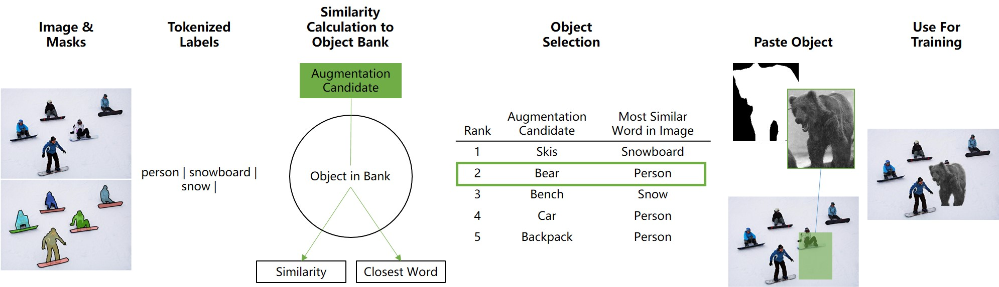

# SemAug

## Introduction

Data augmentation is an essential technique in improving the generalization of deep neural networks. The majority of existing image-domain augmentations either rely on geometric and structural transformations, or apply different kinds of photometric distortions. In this paper, we propose an effective technique for image augmentation by injecting contextually meaningful knowledge into the scenes. Our method of semantically meaningful image augmentation for object detection via language grounding, SemAug, starts by calculating semantically appropriate new objects that can be placed into relevant locations in the image (the _what_ and _where_ problems). Then it embeds these objects into their relevant target locations, thereby promoting diversity of object instance distribution. Our method allows for introducing new object instances and categories that may not even exist in the training set. Furthermore, it does not require the additional overhead of training a context network, so it can be easily added to existing architectures. Our comprehensive set of evaluations showed that the proposed method is very effective in improving the generalization, while the overhead is negligible. In particular, for a wide range of model architectures, our method achieved ~1-2\% mAP improvements for the task of object detection on the COCO dataset.

This code has been modified from the [Instaboost](https://github.com/GothicAi/Instaboost.git) repository, to incorporate SemAug.

This code uses mmdetection, which is an open source object detection toolbox based on PyTorch. It is
a part of the open-mmlab project developed by [Multimedia Laboratory, CUHK](http://mmlab.ie.cuhk.edu.hk/).

<p align="center">

</p>


## Installation

Please refer to [INSTALL.md](INSTALL.md) for installation and dataset preparation.


## Train a model

mmdetection implements distributed training and non-distributed training,
which uses `MMDistributedDataParallel` and `MMDataParallel` respectively.

### Distributed training (Single or Multiples machines)

mmdetection potentially supports multiple launch methods, e.g., PyTorch’s built-in launch utility, slurm and MPI.

We provide a training script using the launch utility provided by PyTorch.

```shell
./tools/dist_train.sh <CONFIG_FILE> <GPU_NUM> [optional arguments]
```

Supported arguments are:

- --validate: perform evaluation every k (default=1) epochs during the training.
- --work_dir <WORK_DIR>: if specified, the path in config file will be replaced.

Expected results in WORK_DIR:

- log file
- saved checkpoints (every k epochs, defaults=1)
- a symbol link to the latest checkpoint

**Important**: The default learning rate is for 8 GPUs. If you use less or more than 8 GPUs, you need to set the learning rate proportional to the GPU num. E.g., modify lr to 0.01 for 4 GPUs or 0.04 for 16 GPUs.

An example is:

```shell
./tools/dist_train_copy.sh configs/mask_rcnn_r101_fpn_1x_semaug_embedding_200.py 8 --validate 
```

## Augmented image examples

Examples of the pasted object being chosen from the same category, but different instances for each iteration.

<p align="center">

</p>

Examples of the pasted object being chosen from different categories.

<p align="center">

</p>

## Technical details

Some implementation details and project structures from the original repository are described in the [technical details](TECHNICAL_DETAILS.md).


## License

This project is released under the [Apache 2.0 license](LICENSE).
